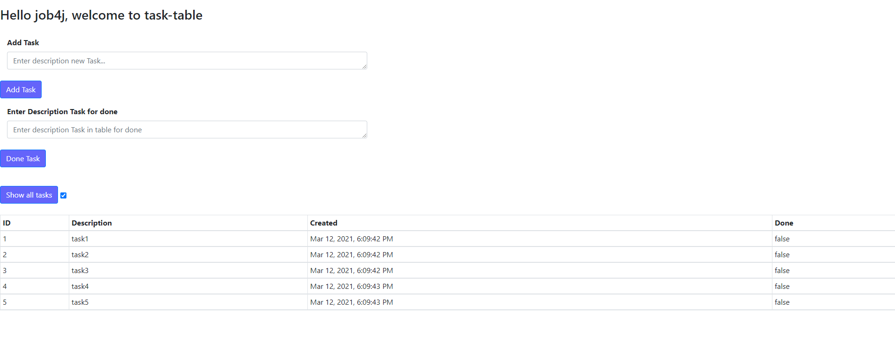
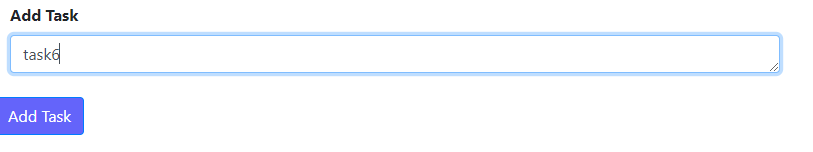

# job4j_todo

Technologies:
- Servlets
- Simple HTML/JS(JQueue|Ajax)/CSS
- Hibernate
- Apache Tomcat
- OOP
- slf4j/log4j
- PostgreSQL
- Travis CI / CodeCov / CheckStyle

The application demonstrates the list of tasks, you can add a new one and mark the completion task.
This application you can use for control daily tasks at yours work.

Interface in my Application

You can add Tasks

You see added task in table

You can do task, you need to enter a description of the task in field

Then press button you can see in a table task mark that status 'Done' change false to true

You can see all tasks completed/unfulfilled (true/false on Column 'Done') or unfulfilled only. 
To do this, you need to click on the button 'Show all tasks'

Then checkbox active - you see All tasks.

Then checkbox no active - you see unfulfilled tasks.

